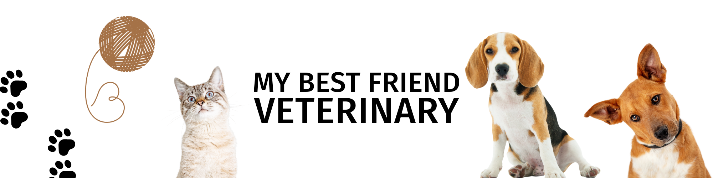
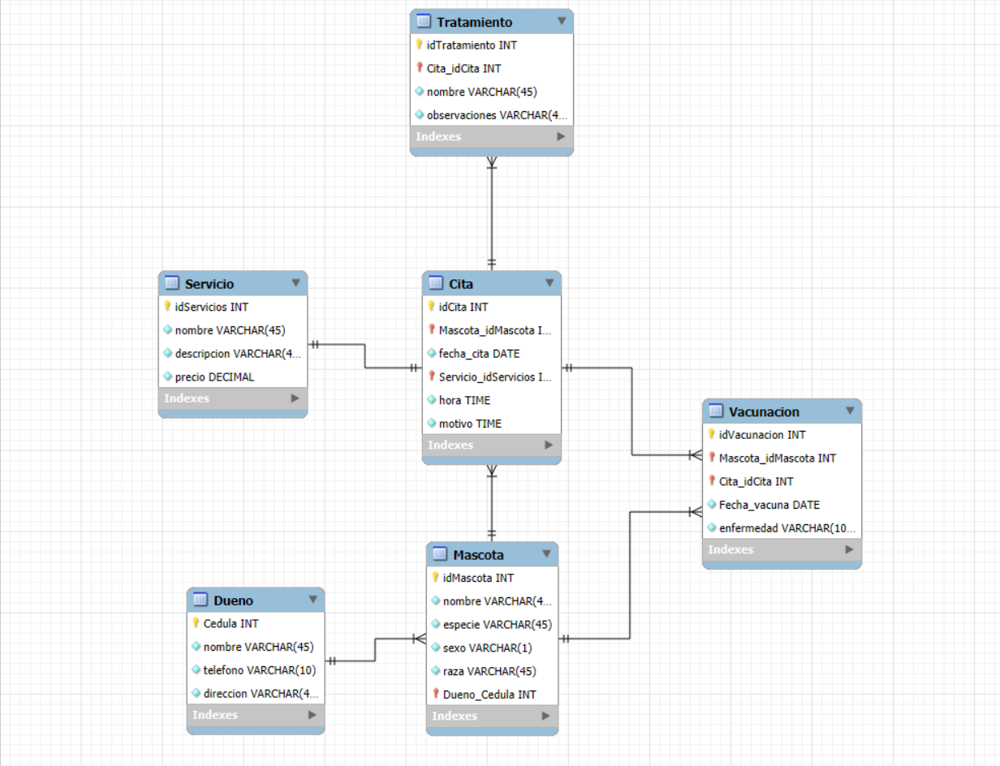

<p align="center">
  
</p>


# My-Best-Friend-veterinary 🐾

El centro de atención para mascotas "Mi Mejor Amigo" requiere la creación de una base de datos con el objetivo de optimizar sus procesos administrativos, permitiendo un acceso más ágil y eficiente a la información relacionada con:

- 📅 Citas veterinarias

- 💊 Tratamientos médicos

- 👤 Propietarios de las mascotas

- 🐶🐱 Mascotas registradas

- 🧾 Servicios ofrecidos por el centro

Esta sección documenta el proceso seguido para diseñar y construir la base de datos, desde el análisis inicial hasta el modelo final implementado.

## Planeación | Diagrama UML E-R

Para la creación del diagrama entidad-relación se establecieron seis entidades principales, que representan las tablas fundamentales de la base de datos:

- **Dueño:** Representa a los propietarios de las mascotas.

- **Mascota:** Contiene la información individual de cada animal atendido.

- **Cita:** Registra los encuentros programados entre el cliente y el centro.

- **Servicio:** Describe los servicios que ofrece el centro veterinario.

- **Tratamiento:** Detalla los procedimientos médicos aplicados a las mascotas.

- **Vacunación:** (Entidad adicional) Almacena la información relacionada con las vacunas aplicadas.

Estas entidades se relacionan entre sí para garantizar la integridad y consistencia de los datos, permitiendo una gestión eficiente de las operaciones diarias del centro veterinario.

<p align="center">
  
</p>


### 🔗 Cardinalidades del Modelo
Las relaciones entre las entidades fueron definidas con las siguientes cardinalidades, lo cual permite representar con precisión la lógica del negocio del centro veterinario:

- Dueño 🧑‍⚕️ – Mascota 🐾
1 : N → Un dueño puede tener varias mascotas, pero cada mascota tiene un solo dueño.

- Mascota 🐾 – Vacunación 💉
1 : N → Una mascota puede recibir múltiples vacunaciones a lo largo del tiempo.

- Mascota 🐾 – Cita 📅
1 : N → Una mascota puede tener varias citas médicas.

- Vacunación 💉 – Cita 📅
N : 1 → Varias vacunaciones pueden registrarse en una misma cita.

- Cita 📅 – Servicio 🧾
1 : N → En una cita se pueden aplicar varios servicios.

- Cita 📅 – Tratamiento 💊
1 : N → Una cita puede incluir múltiples tratamientos.

## Estructura DDL (Data Definition Language)

### 📌 Creacion de la base de datos:
```sql
CREATE DATABASE IF NOT EXISTS mi_mejor_amigo_DB;

USE mi_mejor_amigo_DB;
```
Como primer paso, se crea la base de datos denominada "Mi Mejor Amigo DB", la cual servirá como repositorio central para almacenar y gestionar la información relacionada con el sistema veterinario. Una vez creada la base de datos, se procede a la construcción de las tablas que componen el modelo relacional, siguiendo una estructura lógica y normalizada que permite mantener la integridad de los datos y las relaciones entre las entidades.

### Creacion de las entidades:

#### 🧾 Tabla: Dueño

```sql
CREATE TABLE Dueno (
	cedula INT PRIMARY KEY,
    nombre VARCHAR(100) NOT NULL,
    telefono VARCHAR(20) NOT NULL,
    direccion VARCHAR(45) NOT NULL
);
```
Esta tabla almacena la información básica de los propietarios de las mascotas que visitan la veterinaria.

- cedula: Identificador único del dueño. Se utiliza como clave primaria.

- nombre: Nombre completo del propietario. Es obligatorio.

- telefono: Número de contacto del propietario. Es obligatorio.

- direccion: Dirección de residencia del propietario. Es obligatoria.

La clave primaria cedula asegura que cada dueño esté registrado de manera única en el sistema, permitiendo establecer relaciones con otras tablas como Mascota.

#### 🐾 Tabla: Mascota

```sql
CREATE TABLE Mascota (
    idMascota INT AUTO_INCREMENT PRIMARY KEY,
    nombre VARCHAR(100) NOT NULL,
    especie VARCHAR(50) NOT NULL,
    sexo CHAR(1) CHECK (sexo IN ('M', 'F')),
    raza VARCHAR(50),
    Dueno_Cedula INT,
    FOREIGN KEY (Dueno_Cedula) REFERENCES Dueno(cedula)
);
```


Esta tabla contiene la información de las mascotas registradas en la veterinaria, asociadas a un dueño.

- idMascota: Identificador único de cada mascota. Clave primaria con incremento automático.

- nombre: Nombre de la mascota. Campo obligatorio.

- especie: Tipo de animal (ej. perro, gato, ave, etc.). Obligatorio.

- sexo: Sexo de la mascota. Se restringe a dos valores posibles: 'M' (macho) y 'F' (hembra).

- raza: Raza de la mascota. Campo opcional.

- Dueno_Cedula: Clave foránea que referencia a la cédula del dueño en la tabla Dueno.

La relación con Dueno permite identificar rápidamente quién es el propietario de cada mascota y gestionar su historial clínico de forma ordenada.


#### 🛠️ Tabla: Servicio

```sql
CREATE TABLE Servicio (
	idServicio INT AUTO_INCREMENT PRIMARY KEY,
    nombre VARCHAR(50) NOT NULL,
    descripcion VARCHAR(200) NOT NULL,
    precio DECIMAL(10,2) NOT NULL
);
```

Esta tabla define los distintos servicios veterinarios que ofrece la clínica.

- idServicio: Identificador único del servicio. Es la clave primaria con incremento automático.

- nombre: Nombre del servicio ofrecido (por ejemplo: consulta general, baño, desparasitación). Campo obligatorio.

- descripcion: Breve explicación del servicio, su finalidad o procedimiento. Campo obligatorio.

- precio: Costo del servicio, expresado con precisión de dos decimales. Campo obligatorio.

Gracias a esta tabla, se puede mantener un catálogo estructurado de todos los servicios disponibles en el sistema, lo cual es clave para gestionar citas, facturación y reportes.

#### 📅 Tabla: Cita

```sql
CREATE TABLE Cita (
    idCita INT AUTO_INCREMENT PRIMARY KEY,
    fecha_cita DATE NOT NULL,
    hora TIME NOT NULL,
    motivo VARCHAR(255),
    Mascota_idMascota INT,
    Servicio_idServicio INT,
    FOREIGN KEY (Mascota_idMascota) REFERENCES Mascota(idMascota),
    FOREIGN KEY (Servicio_idServicio) REFERENCES Servicio(idServicio)
);
```


Esta tabla almacena la información de cada cita médica agendada para una mascota.

- idCita: Identificador único de la cita. Es la clave primaria con incremento automático.

- fecha_cita: Fecha programada para la cita. Campo obligatorio.

- hora: Hora exacta de la cita. Campo obligatorio.

- motivo: Descripción del motivo de la cita. Es un campo opcional que permite especificar síntomas, chequeo general, etc.

- Mascota_idMascota: Clave foránea que hace referencia a la mascota que asiste a la cita (Mascota.idMascota).

- Servicio_idServicio: Clave foránea que indica el tipo de servicio prestado durante la cita (Servicio.idServicio).

Esta estructura permite registrar cuándo, por qué y para qué fue atendida una mascota, manteniendo así un historial clínico organizado y relacionado con los servicios prestados.

#### 💊 Tabla: Tratamiento

```sql
CREATE TABLE Tratamiento (
    idTratamiento INT AUTO_INCREMENT PRIMARY KEY,
    nombre VARCHAR(50) NOT NULL,
    observaciones TEXT NOT NULL,
    Cita_idCita INT NOT NULL,
    FOREIGN KEY (Cita_idCita) REFERENCES Cita(idCita)
);
```

La tabla Tratamiento almacena la información de los procedimientos médicos realizados a las mascotas durante una cita.

- idTratamiento: Identificador único del tratamiento. Es la clave primaria y se genera automáticamente.

- nombre: Nombre del tratamiento aplicado (por ejemplo: antibiótico, curación, control de parásitos). Campo obligatorio.

- observaciones: Campo de texto para registrar detalles importantes del tratamiento, como evolución, reacciones o recomendaciones posteriores. Campo obligatorio.

- Cita_idCita: Clave foránea que relaciona el tratamiento con la cita en la cual fue aplicado. Hace referencia a Cita(idCita).

Esta tabla permite llevar un historial clínico detallado de los tratamientos proporcionados, vinculando cada intervención médica con una cita específica.

#### 💉 Tabla: Vacunacion

```sql
CREATE TABLE Vacunacion (
    idVacunacion INT AUTO_INCREMENT PRIMARY KEY,
    fecha_vacuna DATE NOT NULL,
    enfermedad VARCHAR(100) NOT NULL,
    Mascota_idMascota INT,
    Cita_idCita INT,
    FOREIGN KEY (Mascota_idMascota) REFERENCES Mascota(idMascota),
    FOREIGN KEY (Cita_idCita) REFERENCES Cita(idCita)
);
```

La tabla Vacunacion registra las vacunas aplicadas a las mascotas, con el fin de mantener un historial de inmunización y controlar enfermedades prevenibles.

- idVacunacion: Identificador único de cada registro de vacunación. Se genera automáticamente.

- fecha_vacuna: Fecha en que fue aplicada la vacuna. Campo obligatorio.

- enfermedad: Nombre de la enfermedad contra la cual inmuniza la vacuna (por ejemplo: rabia, moquillo, parvovirus). Campo obligatorio.

- Mascota_idMascota: Clave foránea que relaciona la vacuna con la mascota correspondiente. Hace referencia a Mascota(idMascota).

- Cita_idCita: Clave foránea que vincula la vacunación con la cita médica donde fue aplicada. Hace referencia a Cita(idCita).

Esta tabla fortalece el control veterinario, asegurando el seguimiento correcto del esquema de vacunación de cada mascota.


